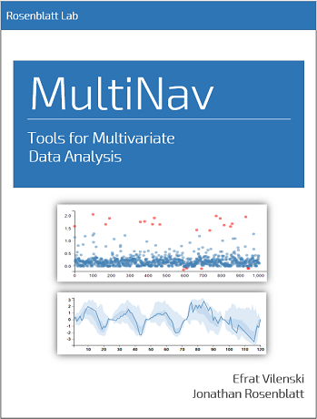

--- 
title: "MultiNav R Package"
author: "Efrat Vilenski Supervised by Dr. Jonathan Rosenblatt"
institute: 
   - Dept. of Industrial Engineering and Management,
   - Ben Gurion University of the Negev, Israel.
date: "`r Sys.Date()`"
site: bookdown::bookdown_site
output: bookdown::gitbook
always_allow_html: yes
documentclass: book
bibliography: [book.bib, packages.bib]
biblio-style: apalike
link-citations: yes
github-repo: rstudio/bookdown-demo
description: "MultiNav Documentation"
---

# Preface

  

 

This is the documentation for <em>MultiNav R Package</em>! Visit the <a href="https://github.com/EfratVil/MultiNav">github repository</a> for this project.

 This work  is licensed under a <a rel="license" href="http://creativecommons.org/licenses/by-nc-sa/3.0/us/">Creative Commons Attribution-NonCommercial-ShareAlike 3.0 United States License</a>.

